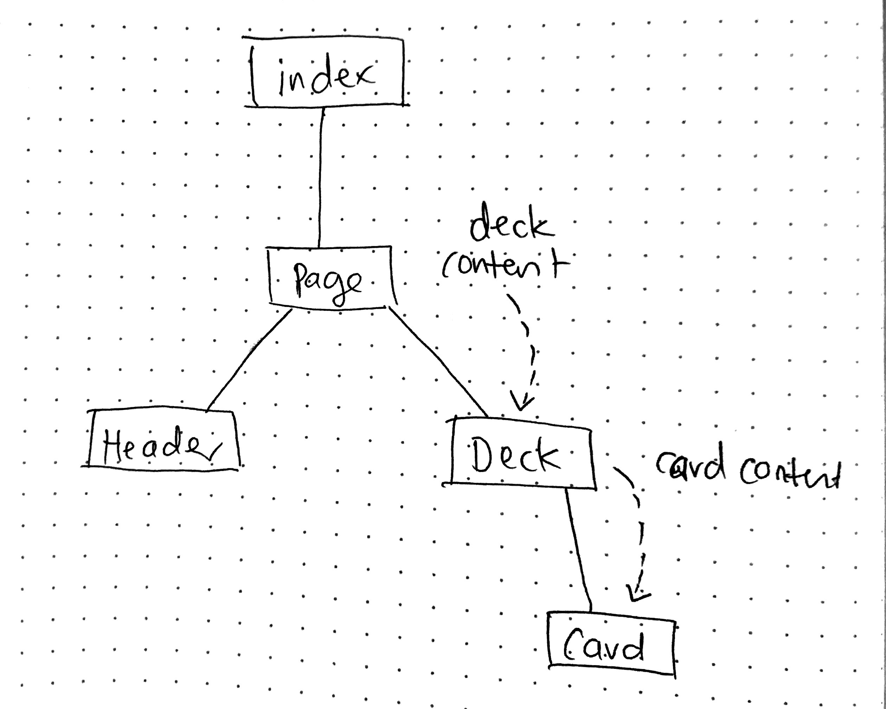

# LAB - 29 A

## Component Composition

### Author: Joanna Arroyo

### Links and Resources
* [submission PR](https://github.com/joanna-401-advanced-javascript/lab-29-component-composition/pull/1)
* [travis](https://travis-ci.com/joanna-401-advanced-javascript/lab-29-component-composition)

#### Documentation
* [styleguide](http://localhost:6060/)

### Modules
#### `index.js`, `page.js`, `Header.js`, `Deck.js`, `Card.js`, `setupTests.js`
##### Exported Values and Methods

###### `Page -> React Page component`
###### `Header -> React Header component`
###### `Deck -> React Deck component`
###### `Card -> React Card component`

### Setup

#### Running the app
* `npm start`
* Endpoint: `/code`
  * Code rendered with JSX
* Endpoint: `/about`
  * Static About Us page
  
#### Tests
* Unit tests: `npm run test`
   * Render tests
* Lint tests: `npm run lint`

#### UML
